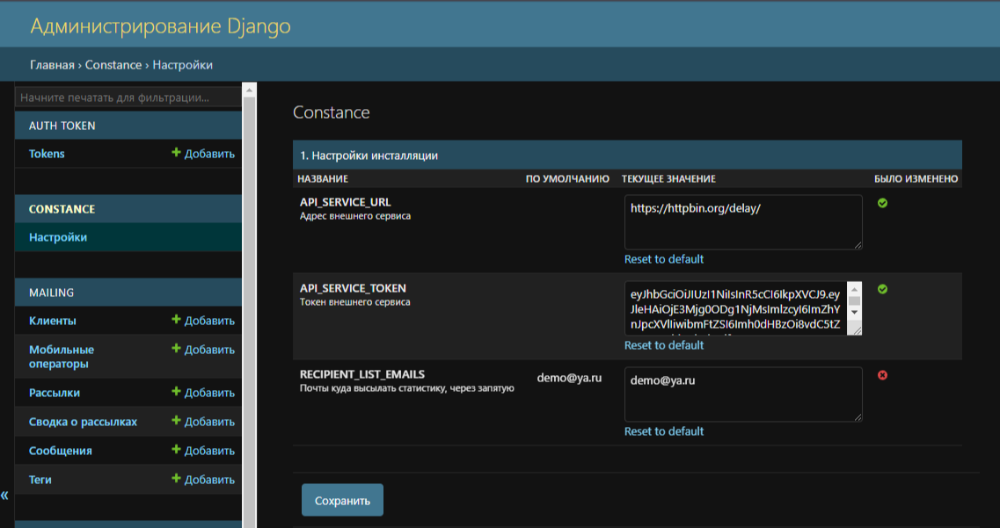
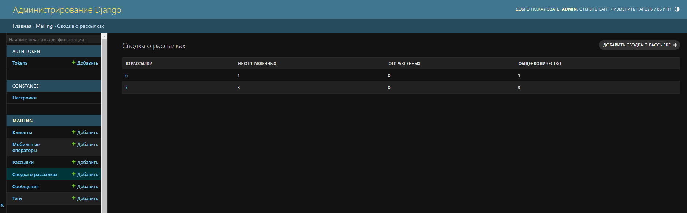
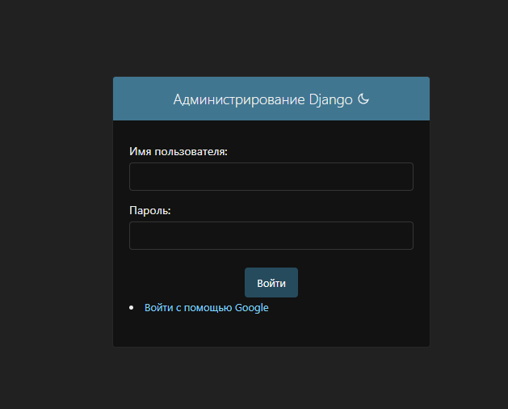
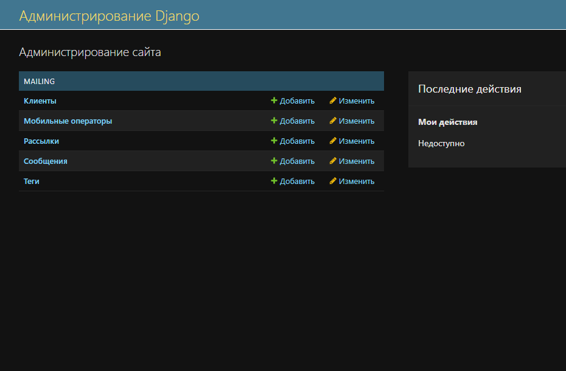

# Проект Notification  - сервис уведомлений

## Технологии:
[](https://www.python.org/)
[](https://www.djangoproject.com/)
[](https://www.django-rest-framework.org/)
[](https://www.postgresql.org/)
[](https://nginx.org/ru/)
[](https://gunicorn.org/)
[](https://www.docker.com/)

Celery

## Задача

Необходимо разработать сервис управления рассылками API администрирования и получения статистики.

## Описание
- Необходимо реализовать методы создания новой рассылки, просмотра созданных и получения статистики по выполненным рассылкам.
- Реализовать сам сервис отправки уведомлений на внешнее API.
- Опционально выбрать любое количество дополнительных пунктов описанных после основного.

## Основное задание

Спроектировать и разработать сервис, который по заданным правилам запускает рассылку по списку клиентов.

### Сущность "рассылка" имеет атрибуты:

* уникальный id рассылки
* дата и время запуска рассылки
* текст сообщения для доставки клиенту
* фильтр свойств клиентов, на которых должна быть произведена рассылка (код мобильного оператора, тег)
* дата и время окончания рассылки: если по каким-то причинам не успели разослать все сообщения - никакие сообщения клиентам после этого времени доставляться не должны

### Сущность "клиент" имеет атрибуты:


* уникальный id клиента
* номер телефона клиента в формате 7XXXXXXXXXX (X - цифра от 0 до 9)
* код мобильного оператора
* тег (произвольная метка)
* часовой пояс

### Сущность "сообщение" имеет атрибуты:

* уникальный id сообщения
* дата и время создания (отправки)
* статус отправки
* id рассылки, в рамках которой было отправлено сообщение
* id клиента, которому отправили

## Спроектировать и реализовать API для:

* добавления нового клиента в справочник со всеми его атрибутами
* обновления данных атрибутов клиента
* удаления клиента из справочника
* добавления новой рассылки со всеми её атрибутами
* получения общей статистики по созданным рассылкам и количеству отправленных сообщений по ним с группировкой по статусам
* получения детальной статистики отправленных сообщений по конкретной рассылке
* обновления атрибутов рассылки
* удаления рассылки обработки активных рассылок и отправки сообщений клиентам

## Логика рассылки

* После создания новой рассылки, если текущее время больше времени начала и меньше времени окончания - должны быть выбраны из справочника все клиенты, которые подходят под значения фильтра, указанного в этой рассылке и запущена отправка для всех этих клиентов.
* Если создаётся рассылка с временем старта в будущем - отправка должна стартовать автоматически по наступлению этого времени без дополнительных действий со стороны пользователя системы.
* По ходу отправки сообщений должна собираться статистика (см. описание сущности "сообщение" выше) по каждому сообщению для последующего формирования отчётов.
* Внешний сервис, который принимает отправляемые сообщения, может долго обрабатывать запрос, отвечать некорректными данными, на какое-то время вообще не принимать запросы. Необходимо реализовать корректную обработку подобных ошибок. Проблемы с внешним сервисом не должны влиять на стабильность работы разрабатываемого сервиса рассылок.

## API внешнего сервиса отправки

Для интеграции с разрабатываемым проектом в данном задании существует внешний сервис, который может принимать запросы на отправку сообщений в сторону клиентов.
OpenAPI спецификация находится по адресу: https://probe.fbrq.cloud/docs
В этом API предполагается аутентификация с использованием JWT. Токен доступа предоставлен вам вместе с тестовым заданием.

## Дополнительные задания
Выполненные опциональные пункты:
1. организовать тестирование написанного кода
2. обеспечить автоматическую сборку/тестирование с помощью GitLab CI
3. подготовить docker-compose для запуска всех сервисов проекта одной командой
4. сделать так, чтобы по адресу /docs/ открывалась страница со Swagger UI и в нём отображалось описание разработанного API. Пример: https://petstore.swagger.io
5. реализовать администраторский Web UI для управления рассылками и получения статистики по отправленным сообщениям
6. обеспечить интеграцию с внешним OAuth2 сервисом авторизации для административного интерфейса. Пример: https://auth0.com
7. реализовать дополнительный сервис, который раз в сутки отправляет статистику по обработанным рассылкам на email
8. удаленный сервис может быть недоступен, долго отвечать на запросы или выдавать некорректные ответы. Необходимо организовать обработку ошибок и откладывание запросов при неуспехе для последующей повторной отправки. Задержки в работе внешнего сервиса никак не должны оказывать влияние на работу сервиса рассылок.
9. реализовать дополнительную бизнес-логику: добавить в сущность "рассылка" поле "временной интервал", в котором можно задать промежуток времени, в котором клиентам можно отправлять сообщения с учётом их локального времени. Не отправлять клиенту сообщение, если его локальное время не входит в указанный интервал.
10. обеспечить подробное логирование на всех этапах обработки запросов, чтобы при эксплуатации была возможность найти в логах всю информацию по:
    * id рассылки - все логи по конкретной рассылке (и запросы на api и внешние запросы на отправку конкретных сообщений)
    * id сообщения - по конкретному сообщению (все запросы и ответы от внешнего сервиса, вся обработка конкретного сообщения)
    * id клиента - любые операции, которые связаны с конкретным клиентом (добавление/редактирование/отправка сообщения/…)

## Документация
Добавить url и token сервиса в django admin, в разделе Constance. 
Сначала создаем тэги и мобильных операторов. Затем создаем клиентов указав оператора и тэг (опционально). Далее можно создавать рассылки (указав теги или мобильных операторов для фильтрации, если же не указать, рассылка будет отправленна всем клиентам), после создания создаются запланированные задачи (django-celery-beat) на каждый день в количестве указанных дней, при наступлении указанного времени запускается процесс рассылки: создания и отправки сообщений с помощью Celery и Redis:
- Отправка сообщений происходит в указанный интервал с учетом часового пояса клиента.
- В случае неудачной отправки сообщения на сторонний сервис, применяется тактика: повторно запускается задача с интервалом 6 минут и не более 10 попыток до успешного ответа или если время рассылки вышло. В таком случае сообщение считается не отправленным.
- Так же каждое утро в 5:30 отправляется статистика за прошедшие сутки на указанные в админке в разделе constance электронные почты.

Для отправки через email, заполнить файл .env данными:
```
EMAIL_HOST=
DEFAULT_FROM_EMAIL=
EMAIL_HOST_USER=
EMAIL_HOST_PASSWORD=
EMAIL_PORT=
```

#### Эндпоинты сервиса:

| Эндпоинт         | Описание                           |Метод                 |
|------------------|-----------------------------------|-----------------------|
| /backend/clients/  | Просмотр всех клиентов         |       GET               |
| /backend/clients/   | Создание клиента          |          POST           |
| /backend/clients/{id}/   | Детальный просмотр клиента        |        GET              |
| /backend/clients/{id}/   | Полное обновление клиента        |        PUT              |
| /backend/clients/{id}/   | Частичное обновление клиента        |        PATCH              |
| /backend/clients/{id}/   | Удаление клиента        |        DELETE              |
| /backend/mailings/  | Просмотр всех рассылок         |       GET               |
| /backend/mailings/   | Создание рассылки          |          POST           |
| /backend/mailings/statistic/  | Общая статистика по всем рассылкам         |       GET               |
| /backend/mailings/{id}/statistics/   | Детальная статистика рассылки        |        GET              |
| /backend/mailings/{id}/   | Детальный просмотр рассылки        |        GET              |
| /backend/mailings/{id}/   | Полное обновление рассылки        |        PUT              |
| /backend/mailings/{id}/   | Частичное обновление рассылки        |        PATCH              |
| /backend/mailings/{id}/   | Удаление рассылки        |        DELETE              |
| /backend/tags/  | Просмотр всех тэгов         |       GET               |
| /backend/tags/   | Создание тэга          |          POST           |
| /backend/tags/{id}/   | Детальный просмотр тэга        |        GET              |
| /backend/tags/{id}/   | Полное обновление тэга        |        PUT              |
| /backend/tags/{id}/   | Частичное обновление тэга        |        PATCH              |
| /backend/tags/{id}/   | Удаление тэга        |        DELETE              |
| /backend/mobile_operators/  | Просмотр всех мобильных операторов         |       GET               |
| /backend/mobile_operators/   | Создание оператора          |          POST           |
| /backend/mobile_operators/{id}/   | Детальный просмотр оператора        |        GET              |
| /backend/mobile_operators/{id}/   | Полное обновление оператора        |        PUT              |
| /backend/mobile_operators/{id}/   | Частичное обновление оператора        |        PATCH              |
| /backend/mobile_operators/{id}/   | Удаление оператора        |        DELETE              |

Статистика по отправленным сообщениям в административном интерфейсе. 
Авторизация в административный интерфейс возможна через google account. 

Что видит пользователь после авторизации через google. 

## Запуск проекта 
Для авторизации через google (если авторизация не нужна, можете пропустить этот этап), понадобиться:
Пройти по адресу https://console.cloud.google.com/projectcreate - укажите произвольное название проекта.
После создания проекта выбрать в  разделе APIs and services подпункт Credentials. Затем выбрать CREATE CREDENTIALS и выбрать OAuth client ID. Вы будете перенаправлены на oauth consent screen, выберите External в поле UserType и нажмите CREATE.
Далее в разделе Appname укажите произвольное название проекта и введите свой адрес эклектронной почты в поле User support email. В разделе Authorised domains введите localhost. Далее сохраняете до момента сводной информации там нажмите back to dashboard.
В меню на левой боковой панели нажмите по Credentials и снова по Create credentials, а затем на OAuth client ID.
В качестве дальнейшего шага введите следующую ниже информацию:
* Application type: выберите Web application
* Name: укажите произвольное название проекта
* Authorized JavaScript origins: https://localhost
* Authorised redirect URIs: https://localhost/backend/social-auth/complete/google-oauth2/

Нажмите CREATE. Вы получите ключи Your Client ID и Your Client Secret. Добавьте оба ключа в файл .env:
```
SOCIAL_AUTH_GOOGLE_OAUTH2_KEY = 'XXX' # Your Client ID
SOCIAL_AUTH_GOOGLE_OAUTH2_SECRET = 'XXX' # Your Client Secret
```

Создать файл окружения и заполнить необходимыми параметрами:
```
touch .env
SECRET_KEY='your_key'
DEBUG=0
DB_NAME= # имя базы данных
POSTGRES_USER= # логин для подключения к базе данных
POSTGRES_PASSWORD= # пароль для подключения к БД 
DB_HOST=db # название сервиса (контейнера)
DB_PORT=5432 # порт для подключения к БД
REDIS_HOST=redis
# остальные можно заполнять опционально
SOCIAL_AUTH_GOOGLE_OAUTH2_KEY=
SOCIAL_AUTH_GOOGLE_OAUTH2_SECRET=
ALLOWED_HOSTS=
API_SERVICE_URL=    # адрес внешнего сервиса 
API_SERVICE_TOKEN=  # точкен внешнего сервиса
RECIPIENT_LIST_EMAILS=  # список почт, куда высылать статистику, указывается через запятую
TIME_ZONE=
EMAIL_HOST= 
DEFAULT_FROM_EMAIL=
EMAIL_HOST_USER=
EMAIL_HOST_PASSWORD=
EMAIL_PORT=
```
#### Запуск через docker
Клонируйте репозиторий, перейдите в папку, установите docker и docker-compose если нужно.
Запустить приложения в контейнерах:
```
docker-compose up --build
```
или для запуска в фоном режиме:
```
docker-compose up -d --build
```
### После успешной сборки выполните команды:
#### Выполните миграции:
```
docker-compose exec web python manage.py migrate
docker-compose exec backend python manage.py collectstatic --no-input
```
#### Создать суперпользователя Django:
```
docker-compose exec web python manage.py createsuperuser
```
#### Остановить контейнер:
```
docker-compose stop
```
#### Запуск на локальном хосте
Клонируйте репозиторий, перейдите в папку, создайте виртуальное окружение.
```
python3 -m venv venv
source venv/bin/activate    # для macos, linux
source venv/Scripts/activate    # windows
```
Установить зависимости:
```
pip install --upgrade pip
pip install -r requirements.txt
```
Если нужно sqlite вместо Postgresql, уберите DB_NAME, POSTGRES_USER, POSTGRES_PASSWORD, DB_HOST, DB_PORT из .env
Так же не заполнять REDIS_HOST в .env или же указывать localhost

Выполнить миграции:
```
python manage.py migrate
```
Для создания администратора запустить команду:

```
python manage.py createsuperuser
```

Для запуска redis:

```
redis-cli
```
Если redis находится в docker
```
docker start redis
```
Для запуска celery:
linux, macos
```
celery -A notification worker -l info
```
windows
```
celery -A notification worker -l info -P solo
```
Для запуска django-celery-beat:
```
celery -A notification beat -l info
```
Так же можно запустить мониторинг celery (опционально)
```
celery -A notification flower
```
Для запуска приложения:
```
python manage.py runserver
```
Для запуска приложения с https протоколом для авторизации через oauth:
```
python manage.py runserver_plus --cert-file ssl/cert.crt 8000
```

P.S. Самописный сертификат в проекте сгенерирован с помощью openssl.

### Автор
Selivanov Dmitry